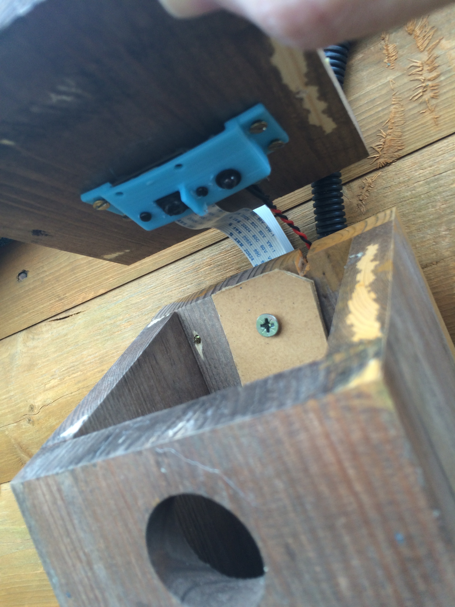

# Raspberry Pi live streaming Bird bird box

This repository supports my [blog post](http://www.pi-tutorials.co.uk/birdbox)

## Software guides and associated files

###[Infra red LED](http://www.pi-tutorials.co.uk/post/141844642590/raspberry-pi-bird-box)

* irLED.py

###[Logging temperature to ThingSpeak](http://www.pi-tutorials.co.uk/post/142198754939/raspberry-pi-bird-box)

* Read temperature - ds18b20.py - Many thanks [Matt Hawkins](http://raspberrypi-spy.co.uk)
* Log to ThingSpeak - log_temp.py

###Streaming to ustream

* [raspivid](http://www.pi-tutorials.co.uk/post/142702979779/raspberry-pi-bird-box)
ustream.sh
* [picamera](http://www.pi-tutorials.co.uk/post/143079533229/raspberry-pi-bird-box)
  * cameraStreamBash.py - This is the python code, basic version this needs to be called by a bash script
  * startPythonStream.sh - This is the script to call the python code above
  * cameraStreamBash1.py - This is the more advance python code which adds the text overlay to the video stream, including the date stamp and live temperature data, this also needs to be called by the bash script above, just make sure you edit the file name so the correct python file is run
  * thingspeak.py - This is a local copy of the thingspeak library, I have modified this so I can retrieve the latest temperature from thingspeak more easily.  Make sure this is in the same directory as your python and bash script.  You only need this is if you are calling data down from thingspeak
